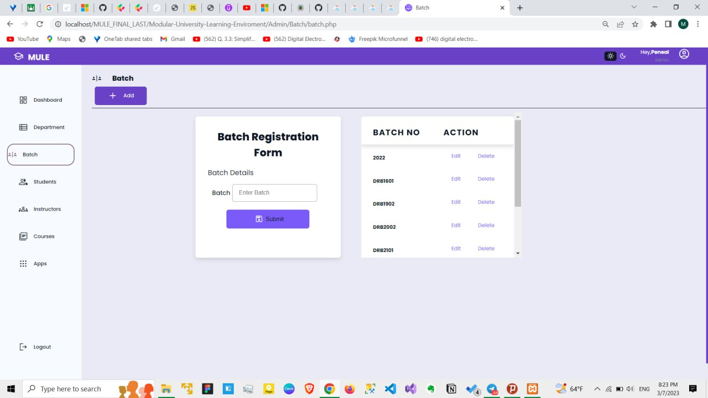

# M.U.L.E. (Modular University Learning Environment)

## Overview
M.U.L.E. is a web-based platform designed to efficiently manage university operations. Built collaboratively with my team, this solution provides an intuitive interface for administrators, instructors, and students to handle essential academic workflows such as course registration, department management, batch assignments, and announcements.

## Features:
1. **Dashboard Overview**: Real-time statistics on active instructors, students, courses, departments, and batches.
   - Visual representation of data using bar charts for quick insights.
   
2. **Department Management**: Add, edit, and delete university departments.
   - Seamless tracking of department details for efficient management.

3. **Batch Management**: Easily register and manage batches with an intuitive batch form.
   - View and edit batch details to ensure up-to-date information.

4. **Student & Instructor Management**: Manage student and instructor profiles efficiently.
   - Assign instructors to specific courses and batches based on requirements.

5. **Course Management**: Allocate courses to batches and instructors.
   - Notify users of new assignments via automated updates.

6. **Announcements**: Send targeted messages or announcements to specific batches.
   - Ensure smooth communication between administrators and students.

## Screenshots
****
****
****************************************************
